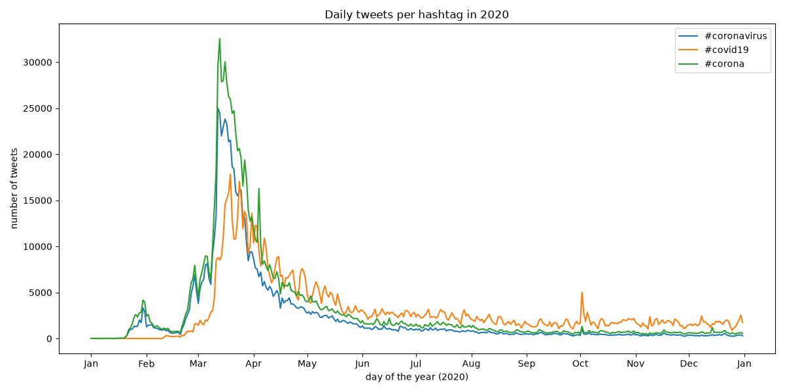

This project analyzes all geotagged tweets from 2020 to track the spread of coronavirus-related hashtags across languages and countries using a Python MapReduce pipeline (`src/map.py`, `src/reduce.py`), which scans the large Twitter dataset, counts hashtag occurrences by tweet language and country code, and reduces the daily outputs into aggregate JSON files. I then visualized the results with `src/visualize.py`, generating bar charts of the top 10 languages and countries for `#coronavirus` and `#코로나바이러스`.

### Tweets with #coronavirus by language

### Tweets with #coronavirus by country

### Tweets with #코로나바이러스 by language

### Tweets with #코로나바이러스 by country

### Daily usage of coronavirus hashtags in 2020
`src/alternative_reduce.py` scans the daily map outputs directly and plots how many tweets used each hashtag on each day of 2020.

